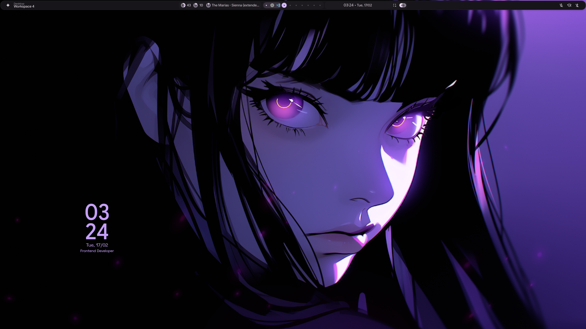
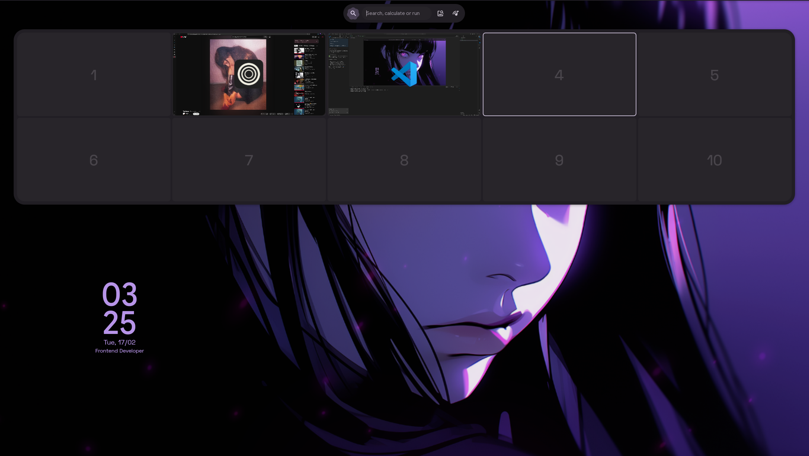
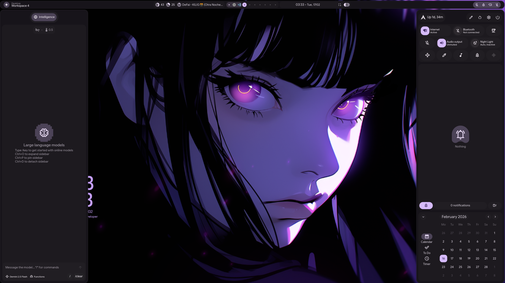

# 🐧 Guía de Instalación Arch Linux + Hyprland

📍 **[English Version](README.md)**

---

## 1️⃣ Crear USB booteable

Descargar ISO desde:
👉 [Arch Linux](https://archlinux.org/download/)

Grabar en USB con:
👉 [Ventoy](https://www.ventoy.net/en/download.html)

## 2️⃣ Conectarse a internet (WiFi)

Antes de usar archinstall, conectar red:

```bash
iwctl
```

Dentro de iwctl:

```bash
device list
station wlan0 scan
station wlan0 get-networks
station wlan0 connect NOMBRE_DE_TU_RED
exit
```

Verificar conexión:

```bash
ping archlinux.org
```

## 3️⃣ Instalar Arch con archinstall

```bash
archinstall
```

### Configurar:

- **Language:** English
- **Disk:** SSD principal
- **Filesystem:** ext4
- **Bootloader:** systemd-boot
- **Profile:** Desktop
- **Desktop:** Hyprland
- **Audio:** pipewire
- **Network:** NetworkManager
- **User:** crear usuario normal (NO trabajar como root)

Instalar y reiniciar.

## 4️⃣ Instalar dotfiles de Hyprland

### Repositorio:
🔗 https://github.com/end-4/dots-hyprland

### Clonar:

```bash
git clone https://github.com/end-4/dots-hyprland
cd dots-hyprland
```

### Dar permisos:

```bash
chmod +x setup.sh
```

### Ejecutar:

```bash
./setup.sh
```

### Reiniciar:

```bash
reboot
```

## 5️⃣ Instalar yay (AUR helper)

Si no está instalado:

```bash
sudo pacman -S --needed base-devel git
git clone https://aur.archlinux.org/yay.git
cd yay
makepkg -si
```

## 6️⃣ Instalar aplicaciones principales

### 🔹 Visual Studio Code

```bash
yay -S visual-studio-code-bin
```

### 🔹 Discord

```bash
yay -S discord
```

### 🔹 Zen Browser

```bash
yay -S zen-browser-bin
```

### 🔹 Gwenview (visor de imágenes)

```bash
sudo pacman -S gwenview
```

### 🔹 Mousepad (editor de texto liviano)

```bash
sudo pacman -S mousepad
```

### 🔹 mpv (reproductor de video/media)

```bash
sudo pacman -S mpv
```

### 🔹 OnlyOffice (alternativa a Word/Excel/PowerPoint)

```bash
yay -S onlyoffice-bin
```

## 7️⃣ Driver NVIDIA (laptop híbrida Intel + NVIDIA)

Solo necesario si el equipo tiene GPU NVIDIA dedicada además de la integrada de Intel. El driver abierto arregla el stutter de Hyprland sobre nouveau y es necesario para edición de video acelerada por GPU (DaVinci Resolve).

```bash
sudo pacman -S --needed nvidia-open nvidia-utils nvidia-settings
```

> `nvidia-open` funciona para GPUs Turing en adelante (GTX 16xx / RTX). Para tarjetas más viejas usar `nvidia` en su lugar.

### Early KMS

Editar `/etc/mkinitcpio.conf` y cambiar `MODULES=()` por:

```
MODULES=(nvidia nvidia_modeset nvidia_uvm nvidia_drm)
```

Regenerar el initramfs:

```bash
sudo mkinitcpio -P
```

### Parámetro de arranque

Buscar tu entrada de systemd-boot:

```bash
ls /boot/loader/entries/
sudo nano /boot/loader/entries/<tu-entrada>.conf
```

Agregar `nvidia-drm.modeset=1` al final de la línea `options`, ej.:

```
options root=PARTUUID=... rw rootfstype=ext4 nvidia-drm.modeset=1
```

### Servicios de suspensión

```bash
sudo systemctl enable nvidia-suspend.service nvidia-hibernate.service nvidia-resume.service
```

### PRIME offload (usar la GPU dedicada solo cuando haga falta)

Agregar a `~/.bashrc`, así la Intel queda por defecto (batería) y la NVIDIA solo entra cuando se llama explícitamente:

```bash
nvidia-offload() {
    __NV_PRIME_RENDER_OFFLOAD=1 __NV_PRIME_RENDER_OFFLOAD_PROVIDER=NVIDIA-G0 \
    __GLX_VENDOR_LIBRARY_NAME=nvidia __VK_LAYER_NV_optimus=NVIDIA_only \
    "$@"
}
```

Uso: `nvidia-offload kdenlive`, `nvidia-offload davinci-resolve`

### Reiniciar y verificar

```bash
reboot
nvidia-smi   # debería listar la GPU después de reiniciar
```

## 8️⃣ Mapa de dots-hyprland (qué es seguro editar)

dots-hyprland ("illogical-impulse") usa **Quickshell** (QML), no Waybar, para la barra/dock/sidebars. Distinción clave después de instalar:

| Ruta | Estado |
|---|---|
| `~/.config/hypr/custom/*.lua` | ✅ Segura — tu capa, nunca la tocan los updates. Keybinds/execs/reglas/env van aquí. |
| `~/.config/hypr/hyprland/*.lua` | ⚠️ Gestionada — se sobrescribe con `./setup exp-update`. |
| `~/.config/quickshell/ii/modules/**/*.qml` | ⚠️ Gestionada, **no existe una capa custom/ aquí** — editar la barra (`modules/ii/bar/`) implica editar archivos gestionados directamente. |
| Panel de ajustes dentro de la app (`settings.qml`) | 🔧 Revisar primero aquí antes de tocar QML a mano. |

**Justo después de instalar los dotfiles**, convierte tu config viva en su propio repo git para poder revertir experimentos:

```bash
cd ~/.config/quickshell && git init && git add -A && git commit -m "estado inicial"
cd ~/.config/hypr && git init && git add -A && git commit -m "estado inicial"
```

Referencia completa con árbol de archivos y tabla de tareas: https://claude.ai/code/artifact/4cbc1c38-d102-46a0-91c4-65c46b216fe2 (artifact privado, solo visible logueado en tu cuenta)

---

## 🔐 Respaldo importante (ANTES de formatear)

### Exportar:

- Bookmarks del navegador
- Contraseñas exportadas
- Carpeta `~/.ssh`
- Claves GPG
- `.gitconfig`
- Proyectos importantes
- Wallpapers
- Configuración de Hyprland si la modificaste

---

## 📸 Mi Setup Actual

Aquí están algunos screenshots de mi configuración con Hyprland:

<div align="center">







</div>
